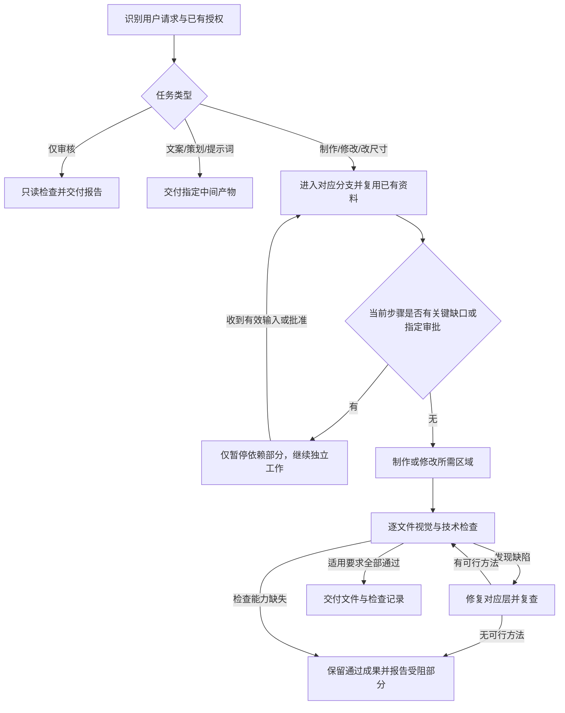

# Amazon KR

> 面向亚马逊商品视觉生产的 Codex Skill：从产品原图和参考设计出发，制作、复刻、修改、改尺寸并验收主图、副图和 A+ 图片。

调用名称：`$amazon-kr`。入口是 [SKILL.md](SKILL.md)，将整个仓库作为一个 skill 目录使用。适用于各类实物商品，不绑定某个历史产品或固定模板。

用户要求制作图片时，交付目标是实际图片文件和检查结果。用户仅要求审核、文案、策划或提示词时，以该项交付物为终点。能力或资料缺失导致图片未完成时，会如实说明，不能将方案冒充成品。

## 生产模式

| 模式 | 处理方式与交付 |
|---|---|
| 主图 | 从权威产品图隔离、修复或有限重建，输出目标规格文件 |
| 商品副图 | 制作解释产品的功能、尺寸、材质、使用、包装、场景等页面 |
| A+ 图片 | 按各模块的实际目标分别设计和导出 |
| 参考图复刻 | 匹配构图与视觉系统，产品事实由用户资料控制 |
| 局部修改 | 复用已有事实和母版，修改相关区域并检查影响 |
| 机械改尺寸 | 保留原始文件与产品比例，按需裁切、延展或重新排版 |
| 仅审核 | 只读检查，交付问题、证据和检查限制，不改图 |
| 仅中间产物 | 按请求交付文案、策划或提示词，不额外生成图片 |

详细分支见 [production-modes.md](references/production-modes.md)。

## 自主执行与审批

共享执行规则以 [SKILL.md](SKILL.md#execution-contract) 为准：

- 资料足够时，连续完成已授权范围内的制作、检查、修复和导出。
- 已提供或已确认的信息直接复用；只询问会改变本次结果且现有证据无法确定的关键缺口。
- 缺口只暂停依赖它的步骤或图片，其余工作继续；等待不代表用户同意默认答案。
- `qa_passed` 是 Agent 按适用要求检查通过，母版可继续复用。
- `user_approved` 只表示用户明确批准及其范围，不能以内部检查冒充。
- 用户要求“母版确认后再继续”时，在该节点等待。已授权缺陷修复不需要再问是否继续。
- 图片制作和交付不自动授权发布到店铺、新增购买或接入新服务。
- 原图与母版保留，修改产生新版本；未通过和实验稿放在最终文件目录之外。

首次制作以 [产品事实表](references/product-intake.md) 提取当前操作需要的证据。已有产品像素不变的背景替换、文字修改或改尺寸，不要求重新确认完整材质清单。

## 工作流程



尺寸可标记为已确认、暂定或待补充。A+ 上传模块未确定时，可继续不依赖尺寸的母版和文案；最终导出必须有已确认或用户授权的目标。暂定尺寸不是已经验证的平台上传要求。

返工修复相关层，不因标题错误重做产品母版。重试必须针对已知缺陷改变方法；反复无改善时，换可靠来源、编辑方法或更简单的真实构图。无法继续时说明阻塞，不能虚报整个任务完成。

## 产品、材质与参考图

- 用户产品资料控制结构、配件数量、Logo、颜色、材质和实际使用方式。
- 参考设计控制构图、机位、光影、配色、字体层级和模块节奏。冲突时调整设计。
- 材质通用规律是辅助判断，不能覆盖真实产品证据。只在本次需要生成或改变材质表现时补充相关缺口。
- 保持真实几何和透视。正视圆面不能被非等比拉伸；斜视圆面可以自然投影为椭圆。
- 制作指令与产品事实分别记录。明确要求的概念改色可以执行并标为概念，不能据此声称存在对应在售变体。
- 性能和兼容性声明需要产品证据。无依据的非必要声明先省略；核心声明缺证据只暂停相关内容。
- 优先使用允许且可用的精确排版工具。若只能生成图内文字，逐字检查和修正；关键文字、Logo 和数据无法核实时不能通过 QA。

需声称或交付当前 Amazon 合规性时，核对目标市场、类目/模块的官方规则并记录日期。纯机械改尺寸不自动触发完整政策审核。无法核对时记录合规性未验证；不把历史尺寸当成永久规则。

## 使用示例

### 制作主图和副图

```text
使用 $amazon-kr，根据这些产品原图制作1张主图和5张副图。
复用已提供的结构、配件、材质和颜色资料；只询问影响本次生成的关键缺口。
最终交付图片文件和检查结果。
```

### 指定人工审批节点

```text
使用 $amazon-kr，先制作产品母版给我确认。
我确认母版后，再制作其余页面。
```

### 制作 A+

```text
使用 $amazon-kr，根据产品资料制作一套A+。上传模块截图稍后补。
先完成不依赖模块尺寸的产品母版和文案，模块尺寸确定后再完成布局和最终导出。
```

### 复刻参考设计

```text
使用 $amazon-kr。第一组是参考设计，第二组是我的产品资料。
匹配参考图的构图、机位、光影和版式；产品结构、材质、Logo、配件和卖点以我的资料为准。
直接交付复刻图片和必要的设计偏差说明。
```

### 局部修改、改尺寸与审核

```text
使用 $amazon-kr，只改第二张图片的标题，其他部分保持不变。
```

```text
使用 $amazon-kr，把这些图适配到指定尺寸。保留原文件和产品比例，
不要裁掉关键信息，新增背景与原设计匹配。
```

```text
使用 $amazon-kr，只审核这五张图，提供缺陷和无法验证的内容，不修改图片。
```

## 建议提供的资料

产品原图、多角度或局部近景、尺寸和包装清单、Logo 与文案、材质颜色参考、卖点证据、参考设计、目标市场/语言/数量/像素尺寸，以及 A+ 模块截图。按本次操作需要提供即可，Agent 负责盘点，不要求用户先填写标准表格。

## 输出与状态

工作区允许时，按任务需要建立：

```text
output/
├── listing-main/
├── listing-secondary/
├── a-plus/
├── masters/
└── audit-report.md
```

只建立实际需要的目录，遵循当前工作区的交付路径要求。每个输出记录 `pending`、`reworking`、`waiting_for_input`、`waiting_for_approval`、`blocked`、`unverified` 或 `qa_passed`；用户批准单独记录。

报告列出目标/实际规格、产品来源、执行过的检查、警告复核结果、修正和未完成内容。可以先交付已通过部分，但任何请求项仍受阻或未验证时，整项生产任务都不应声称全部完成。仅审核任务的报告可以完成，同时指出图片不合格。

## 图片技术校验

[validate_images.py](scripts/validate_images.py) 只读检查 JPEG/PNG 文件解码和明确提供的目标约束。它不能证明产品真实、文字正确、ICC 配置合适、白底区域纯白或 Amazon 合规。疑似棋盘格属于需视觉复核的警告，既不能自动判失败，也不能视作已通过视觉 QA。

安装依赖：

```bash
python -m pip install -r requirements.txt
```

检查相同规格的文件组（尺寸仅为示例）：

```bash
python scripts/validate_images.py ./output/a-plus --width 970 --height 300 --format JPEG --mode RGB --alpha opaque
```

原有 `path --width --height --format` 用法保留。新增参数：

| 参数 | 含义 |
|---|---|
| `--mode` | 目标 Pillow 颜色模式：RGB、RGBA、L、LA、P、CMYK |
| `--alpha opaque` | 所有像素必须完全不透明 |
| `--alpha transparent` | 至少存在一个 alpha 小于 255 的像素；不保证具体对象区域抠图正确 |
| `--recursive` | 递归寻找目录内 JPEG/PNG 文件 |
| `--manifest` | 按清单逐文件检查不同规格 |

透明度检查识别实际像素，包括调色板 PNG 和颜色键透明信息；仅有 alpha 通道但所有像素不透明，不能满足 `transparent`。

混合规格可将以下内容保存为 `output/targets.json`：

```json
{
  "images": [
    {
      "path": "a-plus/hero.jpg",
      "width": 970,
      "height": 300,
      "format": "JPEG",
      "mode": "RGB",
      "alpha": "opaque"
    },
    {
      "path": "listing-secondary/detail.png",
      "width": 600,
      "height": 450,
      "format": "PNG",
      "mode": "RGB",
      "alpha": "opaque"
    }
  ]
}
```

```bash
python scripts/validate_images.py --manifest ./output/targets.json
```

清单路径相对于清单文件，也可以使用绝对路径。每项必填 `path/width/height/format`，可选 `mode/alpha`；尺寸为正整数，路径不能重复。不允许把清单与位置参数或全局目标参数混用。清单只检查列出的文件，需核对它是否覆盖所有请求输出。

退出码与输出：

- `0`：文件可解码，已提供的约束无硬错误；仍可能有警告或未检查目标。
- `1`：文件损坏、不支持，或明确目标不符。
- `2`：路径、命令参数或清单输入错误。
- `WARNING`：疑似棋盘格等需要视觉复核的结果；检测可能误报或漏报。
- `NOT_CHECKED`：未提供的目标没有被核对，不能凭文件自己的尺寸反推其合规。
- `PASS` 仅限脚本实际执行的检查，不是完整图片验收结论。

## 验证开发修改

```bash
python -m unittest discover -s tests -v
```

[脚本回归测试](tests/test_validate_images.py) 覆盖尺寸、格式、颜色模式、透明度、棋盘格提示、混合规格清单和输入错误。[行为验收案例](tests/behavior-cases.md) 用于实际演练或明确标注的文本推演；不能将推演描述为已生成图片的端到端测试。

## 文件职责

- [SKILL.md](SKILL.md)：任务范围、自主执行、审批、返工和完成状态。
- [production-modes.md](references/production-modes.md)：各模式流程差异。
- [product-intake.md](references/product-intake.md)：产品证据与关键缺口。
- [material-fidelity.md](references/material-fidelity.md)：材质还原方法。
- [reference-replication.md](references/reference-replication.md)：参考设计复刻。
- [resizing.md](references/resizing.md)：比例与尺寸适配。
- [visual-qa.md](references/visual-qa.md)：视觉与技术验收。
- [suction-hook-profile.md](references/suction-hook-profile.md)：可选历史示例。

## 支持项目

如果这个 Skill 对你有帮助，欢迎通过赞赏码支持维护：


## 边界与许可证

本项目不是 Amazon 官方产品或认证工具，不负责 PPC、选品、库存、财务或账号运营。

采用 [MIT License](LICENSE)。使用、复制或分发时按许可证保留版权声明和许可证文本。

Copyright © 2026 Youks7
