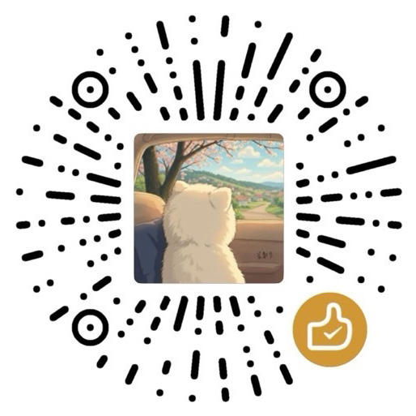

# Amazon KR

**从产品原图到亚马逊主图、副图与 A+ 图片成品。**

Amazon KR 是面向实物商品的 Codex Skill。它把产品资料、参考设计、图片制作和验收组织成一套工作流程：制作时交付实际图片，修改时聚焦指定内容，审核时给出有依据的报告。

[快速开始](#快速开始) · [使用示例](#使用示例) · [协作与交付](#协作与交付) · [图片技术校验](#图片技术校验)

## 为什么使用 Amazon KR

- **围绕真实产品制作。** 优先复用产品原图和经过检查的母版，核对结构、配件、Logo、颜色、材质和使用方式，减少跨页面重绘造成的漂移。
- **复刻设计，也保留自己的商品。** 参考图提供构图、光影、配色和版式；你的资料决定产品与卖点，避免混入竞品结构或未经证实的声明。
- **从制作推进到交付。** 资料足够时连续完成生成、编辑、排版、检查和修复；只有真正影响结果的缺口或你指定的审批节点才暂停相关工作。
- **把检查结果说清楚。** 图片逐张进行适用的视觉与技术检查，区分已通过、待复核和无法验证的内容。

适用于家居、厨具、五金、消费电子、美妆容器、家具、服饰纺织等实物商品。具体成品效果取决于产品资料、可用工具与实际检查结果。

## 能做什么

| 你的需求 | 典型交付 |
|---|---|
| 亚马逊主图 | 白底、产品隔离与修复、变体主图 |
| 商品副图 | 卖点、结构、尺寸、材质、使用、场景与包装内容图 |
| A+ 图片 | 按 Basic/Premium A+ 实际模块规格制作的图片 |
| 参考图复刻 | 使用你的产品重建参考主图、副图或 A+ 视觉设计 |
| 局部修改 | 修改文字、产品区域、颜色或其他指定内容的新文件 |
| 尺寸适配 | 保留产品比例、匹配目标画布的新文件 |
| 视觉审核 | 问题、证据和未验证项报告；仅审核时不改图 |
| 策划、文案或提示词 | 你明确要求的中间产物 |

完整模式说明见 [production-modes.md](references/production-modes.md)。

## 快速开始

### 1. 安装完整 skill

在提供 `$skill-installer` 的 Codex 环境中，可以直接发送：

```text
使用 $skill-installer，从 https://github.com/Youks7/amazon-KR 安装 skill。
SKILL.md 位于仓库根目录，请保留完整目录结构。
```

<details>
<summary>手动安装到当前项目</summary>

首次安装时，在目标项目根目录运行：

```bash
git clone https://github.com/Youks7/amazon-KR.git .agents/skills/amazon-kr
```

确认入口位于 `.agents/skills/amazon-kr/SKILL.md`，并保留同级的 `references/`、`scripts/`、`agents/` 等文件。已有安装目录时更新现有副本，避免重复安装同名 skill。

本地 skill 位置与安装方式参见 [OpenAI 官方说明](https://learn.chatgpt.com/docs/build-skills)。安装后若未显示，可重启 Codex 再检查。

</details>

**运行条件：** 当前会话需要有适合任务的图像生成、编辑或文件处理能力。本仓库提供工作规则和校验脚本，不附带图像模型服务。运行 Python 图片校验器时，还需要安装 [requirements.txt](requirements.txt) 中的 Pillow。

### 2. 提供产品资料和目标

先提供当前任务需要的资料即可，Agent 会负责盘点，不要求你先填写完整表格。

| 建议先给 | 按任务补充 |
|---|---|
| 能看清产品的原图，或要修改的现有图片 | 多角度、接口、材质与细节近景 |
| 要做什么、需要几张、目标语言 | 参考设计、Logo、指定文案 |
| 已知的图片尺寸或上传模块 | 尺寸数据、包装清单、卖点证明 |

A+ 上传尺寸尚未确定时，可以先准备不依赖尺寸的母版和文案；最终导出前再确定目标规格。

### 3. 发出第一条制作请求

安装后，在对话中调用 `$amazon-kr`。例如，附上产品图后发送：

```text
使用 $amazon-kr，根据这些产品原图制作 1 张主图和 5 张副图。
图片使用英文，目标像素尺寸以我附上的规格表为准。
保持产品结构、配件、Logo、颜色和材质一致，只使用有资料支持的卖点。
最终交付图片文件和检查结果。
```

图片数量、语言和规格按你的项目修改。文档中的尺寸示例均为演示，不代表通用 Amazon 上传要求。

## 使用示例

### 制作一套 A+

附上产品资料、文案和实际模块截图：

```text
使用 $amazon-kr，根据产品资料与后台模块截图制作一套 A+ 图片。
每个模块按实际上传尺寸分别排版和导出，整套保持产品与视觉风格一致。
```

模块截图稍后补充时，可以补一句：

```text
先完成不依赖模块尺寸的产品母版和文案，尺寸确定后再完成相关排版与导出。
```

### 复刻参考设计

把参考图和自己的产品资料分开标注：

```text
使用 $amazon-kr。第一组是参考设计，第二组是我的产品资料。
匹配参考图的构图、机位、光影、配色和版式；
产品结构、材质、Logo、配件和卖点以我的资料为准。
交付复刻后的图片，并说明为保持产品真实所做的必要调整。
```

### 只修改一个地方

```text
使用 $amazon-kr，把第二张图的标题改成“Designed for Everyday Use”。
其他文字、产品、背景和布局保持不变，输出修改后的新文件。
```

<details>
<summary>更多请求：改尺寸、只审核、概念改色、指定审批</summary>

**适配尺寸**

```text
使用 $amazon-kr，把这些图适配到我提供的目标尺寸。
保留原文件和产品比例，不裁掉关键信息；新增背景应与原设计匹配。
```

**只审核**

```text
使用 $amazon-kr，只审核这五张图，不修改图片。
逐张指出产品、文案、排版和技术规格问题，并标明缺乏证据而无法判断的部分。
```

**概念改色**

```text
使用 $amazon-kr，把这张产品图改成黑色概念方案，保持结构不变。
这是设计探索，不代表已存在的在售变体，请在交付说明中标明。
```

**先确认母版**

```text
使用 $amazon-kr，先制作产品母版给我确认。
我明确确认后，再制作其余页面。
```

</details>

## 协作与交付

常规生产会依次盘点资料、准备所需母版、制作排版、检查修复并交付。局部修改和改尺寸只执行适用步骤；仅审核、文案或策划请求按其自身交付目标完成。

| 遇到的情况 | Agent 如何处理 |
|---|---|
| 资料足够 | 连续完成已授权工作，包括检查和缺陷修复 |
| 信息已经给过或确认过 | 直接复用，出现实质冲突时才重新澄清 |
| 一张图缺关键产品资料 | 只暂停依赖部分，继续其他有依据的工作 |
| 你要求先审批母版或布局 | 在指定节点等待；内部检查不代替你的批准 |
| 只改背景、标题或尺寸 | 复用现有产品资料，不重新索要无关的材质清单 |
| 工具不可用或问题无法解决 | 保留已通过成果，说明未完成部分和需要补充的条件 |

### 你会收到什么

生产任务交付实际图片与简明检查记录。工作区允许时，按任务需要组织为：

```text
output/
├── listing-main/       # 主图
├── listing-secondary/  # 副图
├── a-plus/             # A+ 模块
├── masters/            # 可复用母版
└── audit-report.md     # 规格、来源、检查与修正记录
```

只建立实际需要的目录，并遵循当前工作区的路径要求。原图保留，修改生成新版本；实验稿和未通过文件与最终交付分开。部分交付会明确标注剩余工作，避免把受阻或未验证的任务说成全部完成。

共享执行规则以 [SKILL.md](SKILL.md#execution-contract) 为准。内部 `qa_passed` 表示适用检查通过，`user_approved` 仅表示你的明确批准。图片制作授权不包含自动发布店铺、购买服务或新增服务访问权限。

## 图片技术校验

[validate_images.py](scripts/validate_images.py) 可检查 JPEG/PNG 解码、尺寸、格式，以及指定的颜色模式和透明度。以下命令在 **skill 根目录**运行；输出路径按实际文件位置修改。

```bash
python -m pip install -r requirements.txt
python scripts/validate_images.py ./output/a-plus --width 970 --height 300 --format JPEG --mode RGB --alpha opaque
```

上例只适用于目标规格相同的图片组。**`PASS` 仅代表脚本实际执行的检查通过，不是完整图片验收或 Amazon 合规证明。** `WARNING` 需要视觉复核，`NOT_CHECKED` 表示对应目标尚未核对。

<details>
<summary>参数、透明度与退出码</summary>

| 参数 | 用途 |
|---|---|
| `path` | 单个图片文件或图片目录 |
| `--width`、`--height` | 正整数目标像素尺寸 |
| `--format` | 目标格式：JPEG 或 PNG |
| `--mode` | 目标颜色模式：RGB、RGBA、L、LA、P、CMYK |
| `--alpha opaque` | 所有像素必须完全不透明 |
| `--alpha transparent` | 至少存在一个 alpha 小于 255 的像素 |
| `--recursive` | 递归查找目录中的 JPEG/PNG 文件 |
| `--manifest` | 按清单逐文件检查不同规格 |

透明度按实际像素检查，包括调色板和颜色键透明信息。仅有 alpha 通道但全部像素不透明，不满足 `transparent`；存在透明像素也不代表产品抠图正确。

疑似棋盘格采用启发式识别，可能误报或漏报。警告要通过视觉检查判定，不能直接当成失败或完整通过。

| 退出码 | 含义 |
|---|---|
| `0` | 文件可解码，已提供的目标约束无硬错误；仍可能存在警告或未检查项 |
| `1` | 图片损坏、格式不支持或明确目标不符 |
| `2` | 路径、命令参数或清单输入错误 |

未提供的目标会显示 `NOT_CHECKED`。脚本不会从图片自己的尺寸反推目标，也不验证产品真实性、文字准确性、ICC 配置、白底区域或当前平台政策。

</details>

<details>
<summary>不同尺寸的图片：使用逐文件清单</summary>

将下列示例保存为 `output/targets.json`，替换为实际路径与目标规格：

```json
{
  "images": [
    {
      "path": "a-plus/hero.jpg",
      "width": 970,
      "height": 300,
      "format": "JPEG",
      "mode": "RGB",
      "alpha": "opaque"
    },
    {
      "path": "listing-secondary/detail.png",
      "width": 600,
      "height": 450,
      "format": "PNG",
      "mode": "RGB",
      "alpha": "opaque"
    }
  ]
}
```

```bash
python scripts/validate_images.py --manifest ./output/targets.json
```

每项必填 `path/width/height/format`，可选 `mode/alpha`；尺寸为正整数，路径不能重复。相对路径以清单文件所在目录为基准，也支持绝对路径。

清单不能与位置参数、全局目标参数或 `--recursive` 混用。脚本只检查列出的文件，需确认清单覆盖全部请求输出。

</details>

## 常见问题

**缺少部分资料，还能开始吗？**  
可以先做有充分依据的部分。会影响真实产品结构、外观或核心声明的缺口，需要补充后才能制作相关内容。

**装好 skill 就能自动生成图片吗？**  
还需要当前会话具备可用且获准的成图能力。没有合适工具时会说明限制，不能用提示词或方案冒充图片成品。

**是否保证符合 Amazon 最新要求？**  
需要断言或交付当前合规性时，要核对目标市场、类目或模块的官方要求，并记录来源与日期。尺寸示例和校验脚本不能替代该检查。

**能不能只要文案、策划或审核？**  
可以，明确写出所需交付物即可。只读审核不会自动改图。

## 项目结构与维护

| 文件 | 职责 |
|---|---|
| [SKILL.md](SKILL.md) | 入口、执行边界、审批与完成规则 |
| [agents/openai.yaml](agents/openai.yaml) | 展示信息与默认调用提示 |
| [product-intake.md](references/product-intake.md) | 产品资料与关键缺口判断 |
| [production-modes.md](references/production-modes.md) | 各类任务的处理流程 |
| [material-fidelity.md](references/material-fidelity.md) | 材质与表面工艺还原 |
| [reference-replication.md](references/reference-replication.md) | 参考设计复刻 |
| [resizing.md](references/resizing.md) | 比例与尺寸适配 |
| [visual-qa.md](references/visual-qa.md) | 视觉与技术验收 |
| [suction-hook-profile.md](references/suction-hook-profile.md) | 可选历史案例，不作为所有产品的规则 |
| [validate_images.py](scripts/validate_images.py) | 图片技术校验工具 |

<details>
<summary>开发验证与反馈</summary>

在 skill 根目录运行：

```bash
python -m unittest discover -s tests -v
```

[脚本回归测试](tests/test_validate_images.py) 覆盖目标规格、透明度、棋盘格提示、混合规格清单与输入错误。[行为验收案例](tests/behavior-cases.md) 用于实际演练或明确标注的文本推演；文本推演不能视为已完成真实图像生成测试。

提交 [Issue](https://github.com/Youks7/amazon-KR/issues) 时，说明任务类型、预期行为、实际结果、相关规则或报错，并在可分享时附上能复现问题的素材。

</details>

## 支持项目

如果 Amazon KR 对你的工作有帮助，欢迎通过赞赏码支持维护。



## 许可与项目边界

本项目采用 [MIT License](LICENSE)，使用、复制或分发时按许可证保留版权声明和许可证文本。

Amazon KR 面向商品图片制作，不负责 PPC、选品、库存、财务或账号运营；本项目不是 Amazon 官方产品或认证工具。

Copyright © 2026 Youks7
