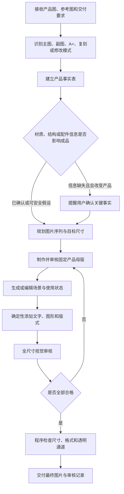

# Amazon KR

> 面向亚马逊商品视觉生产的 Codex Skill：从产品原图和参考设计出发，直接制作、复刻、修改并验收主图、副图和 A+ 图片成品。

Amazon KR 不是只输出策划、文案或提示词的顾问型 Skill。用户要求“制作、生成、设计、复刻或出一套图片”时，它的默认终点是：**实际图片文件已经生成、逐张检查、尺寸与格式验证完成，可以进入上传或交付环节。**

调用名称：`$amazon-kr`

## 能做什么

| 生产模式 | 典型任务 | 默认交付 |
|---|---|---|
| 亚马逊主图 | 白底处理、抠图、产品重建、光影和材质优化、变体主图 | 最终主图文件 |
| 商品副图 | 卖点、结构、尺寸、材质、使用、安装、场景、包装和对比图 | 有顺序的整套副图 |
| A+ 图片 | Basic/Premium A+ 的首屏、功能、材质、场景、对比和品牌模块 | 按模块尺寸导出的图片 |
| 参考图复刻 | 复刻同行主图、副图或整套 A+ 的构图与视觉系统 | 换成用户产品后的成品 |
| 图片修改 | 换产品、换颜色、修结构、改材质、删增物体、修穿模 | 修改后的新文件 |
| 尺寸适配 | 转换画布比例，避免拉伸、裁坏内容、白边或错误背景延展 | 精确目标尺寸的新文件 |
| 视觉审核 | 检查产品、材质、物理逻辑、文案、版式和技术参数 | 审核报告；仅审核时不改图 |

适用于家居、厨具、五金、消费电子、美妆容器、家具、服饰纺织、宠物用品、运动用品、汽车配件等实物商品。工作方法不绑定某一个品类。

## 核心优势

1. **从需求直接走到成品**  
   默认完成主图、副图或 A+ 的实际生成、编辑、排版、导出和验收，不把提示词、策划表或概念稿冒充最终交付。

2. **产品一致性优先于生成自由度**  
   先建立产品事实表和固定产品母版，再跨页面复用；系统性降低结构漂移、比例变化、Logo 错位、配件增减和颜色不一致。

3. **把材质还原当成硬指标**  
   能区分拉丝不锈钢、镜面钢、镀铬、阳极氧化铝、喷粉金属、塑料、玻璃、木材、皮革和织物等不同表面逻辑，并在信息不足时主动提醒用户确认。

4. **参考图复刻与产品真相分离**  
   参考图负责构图、机位、光影、配色和版式；用户资料负责结构、材质、Logo、配件和卖点。既追求视觉相似，也避免把竞品特征复制进用户产品。

5. **一套流程覆盖多种实物品类**  
   不依赖挂钩或某个固定模板，而是从当前产品重新识别部件、使用方式、材质和买家信息需求，适配不同亚马逊类目。

6. **检查真实物理逻辑**  
   不只判断“好不好看”，还检查支撑、连接、开合、安装、握持、穿戴、倾倒、折叠、承重和重力关系，减少漂浮、穿模和错误交互。

7. **生成内容与确定性排版分工**  
   场景、人物、材质和光影交给图像工具；文字、Logo、尺寸线、箭头和最终画布交给可控排版，降低乱码和关键数据错误。

8. **视觉与程序双重验收**  
   先逐张检查产品、材质、文案和版式，再验证像素尺寸、格式、颜色模式和透明通道；不合格图片进入返工循环，不直接混入上传目录。

9. **尺寸变化不靠暴力拉伸**  
   面对不同画布比例时，根据内容选择重新排版、合理裁切或匹配原设计的背景延展，保留产品比例和关键信息。

10. **模块要求与历史模板解耦**  
    优先使用用户提供的实际上传框和模块尺寸；需要判断当前合规性时核对目标市场、类目和最新官方要求，不把旧项目尺寸当成永久规则。

## 核心原则

### 产品事实优先

产品原图、工程图、说明书、包装资料和用户明确说明决定：

- 产品结构和比例
- 部件、接口、配件与包装数量
- Logo、标签和颜色
- 基础材质与表面工艺
- 正确使用、安装和交互方式
- 可以使用的卖点和性能声明

画面再漂亮，只要产品结构、材质、使用逻辑或卖点不真实，就判定为不合格。

### 直接生产优先

除非用户明确要求“只需要方案、提示词、文案或审核报告”，否则任务不能停在策划阶段。Skill 必须调用当前环境中可用的图像生成、图片编辑和本地排版能力，输出实际成品。

如果缺少决定产品外观的必要原图，Skill 会要求用户补充，不会凭空发明商品。如果当前运行环境没有图像能力，必须说明限制，不能假装已经生成图片。

### 生成与排版分离

- 图像工具负责产品修复、场景、人物、道具、材质、光影和使用状态。
- 确定性工具负责文字、Logo、箭头、图标、尺寸线、卡片、网格和最终导出。

这种分工可以减少 AI 乱码、尺寸错误、Logo 漂移和跨页面产品变形。

## 完整工作流程



## 产品事实表

正式生成前，Skill 会把关键信息标记为：

| 状态 | 含义 |
|---|---|
| `Confirmed` | 有当前用户说明、权威产品图或正式资料支持 |
| `Inferred` | 可以从图片推测，但尚未得到明确确认 |
| `Missing/Blocking` | 缺失且不同答案会生成不同产品 |

只有会显著改变结果的问题才会阻塞生成；低风险缺口会被明确写成假设，然后继续工作。

## 材质与表面工艺

材质是产品身份的一部分。用户只说“增强金属质感”时，Skill 不会默认套用夸张镜面效果，而会提醒确认：

- 基础材质：不锈钢、铝、黄铜、ABS、亚克力、玻璃、陶瓷、硅胶、木材、皮革、织物等
- 表面工艺：拉丝、抛光、镀铬、PVD、阳极氧化、喷粉、喷漆、磨砂、上釉、压纹等
- 光泽度：镜面、高光、半哑光、哑光或超哑光
- 拉丝、木纹、织纹或压纹的方向与尺度
- 准确颜色和作为质感基准的近景图

例如，拉丝不锈钢需要方向一致的细密纹理和各向异性高光；喷粉金属需要较柔和的涂层反射；透明玻璃或亚克力需要保留厚度、边缘和折射。这些表现不能相互替代。

## 主图与 A+ 复刻

复刻采用两条相互独立的真相链：

### 参考图控制视觉系统

- 画布比例和留白
- 构图、机位和产品占比
- 背景、光影和阴影
- 配色、字体层级和图文节奏
- 卡片、图标、分割和装饰语言

### 用户资料控制产品

- 外形、比例和部件
- 材质、颜色和表面处理
- Logo、标签、包装与配件
- 使用方式、尺寸和真实卖点

Skill 会先把参考图中的元素标记为 `match`、`adapt`、`replace` 或 `omit`，再重建版式。参考图中的竞品结构、品牌、配件和声明不会覆盖用户产品事实。

主图复刻重点匹配机位、旋转角度、裁切、相对大小、光线、白底和接触阴影；A+ 复刻则逐屏匹配栅格、信息层级、配色、图文比例和模块节奏，并按照实际上传尺寸分别导出。

## 使用方法

将整个仓库作为一个 Codex Skill 目录使用。Skill 入口是 [`SKILL.md`](SKILL.md)，调用名为 `$amazon-kr`。

### 制作主图和副图

```text
使用 $amazon-kr，根据这些产品原图直接制作1张亚马逊主图和5张副图。
先核对产品结构、配件、材质和颜色；信息不足时提醒我确认。
最终交付图片文件，不要只给方案或提示词。
```

### 制作 A+

```text
使用 $amazon-kr，根据产品资料和后台模块截图直接制作一套亚马逊A+。
按上传框显示的尺寸分别设计和导出，保持所有页面中的产品结构与材质一致。
```

### 复刻参考设计

```text
使用 $amazon-kr。第一组是参考主图和A+，第二组是我的产品资料。
复刻参考图的构图、机位、光影、配色和版式节奏；产品结构、材质、Logo、配件和卖点以我的资料为准。
最终直接交付复刻后的图片成品。
```

### 修改或改尺寸

```text
使用 $amazon-kr，把这5张图片改成目标尺寸。
不能拉伸产品、裁掉文字或出现突兀白块；新增画布必须匹配原设计的背景层级。
```

## 建议提供的资料

- 产品白底图和多角度图
- 结构、接口、配件和材质近景
- 产品尺寸、包装清单和说明书
- Logo、品牌颜色和指定文案
- 产品材质、表面工艺与颜色基准
- 需要表达的卖点及证明材料
- 参考主图、副图或 A+ 页面
- 目标市场、语言、图片数量与像素尺寸
- A+ 后台模块或上传框截图
- 必须保留和禁止改变的细节

资料越完整，返工越少；但用户不需要先整理成标准表格，Skill 会负责盘点和归类。

## 默认输出结构

```text
output/
├── listing-main/
├── listing-secondary/
├── a-plus/
├── masters/
└── audit-report.md
```

只创建任务实际需要的目录。通过审核的文件与实验稿、废弃稿分开存放，上传目录中只保留最终成品。

## 图片技术校验

仓库包含 [`scripts/validate_images.py`](scripts/validate_images.py)，用于检查 JPEG/PNG 的像素尺寸、格式、颜色模式和疑似假透明棋盘格。

安装依赖：

```bash
python -m pip install -r requirements.txt
```

检查一个 A+ 输出目录：

```bash
python scripts/validate_images.py ./output/a-plus \
  --width 970 \
  --height 300 \
  --format JPEG
```

退出码：

- `0`：全部通过
- `1`：发现不合格图片
- `2`：路径或输入错误

## 仓库结构

```text
amazon-KR/
├── SKILL.md
├── agents/
│   └── openai.yaml
├── references/
│   ├── material-fidelity.md
│   ├── product-intake.md
│   ├── production-modes.md
│   ├── reference-replication.md
│   ├── resizing.md
│   ├── suction-hook-profile.md
│   └── visual-qa.md
├── scripts/
│   └── validate_images.py
├── requirements.txt
└── README.md
```

详细行为按需加载：

- [`production-modes.md`](references/production-modes.md)：主图、副图、A+、完整套图和修改模式
- [`product-intake.md`](references/product-intake.md)：产品事实表与生成前确认
- [`material-fidelity.md`](references/material-fidelity.md)：材质和表面工艺
- [`reference-replication.md`](references/reference-replication.md)：主图、副图和 A+ 复刻
- [`resizing.md`](references/resizing.md)：不变形的尺寸与比例适配
- [`visual-qa.md`](references/visual-qa.md)：视觉和技术验收
- [`suction-hook-profile.md`](references/suction-hook-profile.md)：历史挂钩案例，仅作为可选示例

## 边界与说明

- 本 Skill 负责亚马逊商品视觉生产，不负责 PPC、广告投放、选品、库存、财务或账号运营。
- 具体图片尺寸来自用户交付要求或当前上传模块，不把历史尺寸当成永久的平台通用规则。
- 需要判断当前亚马逊合规性时，应核对目标市场、类目和 Amazon/Seller Central 的最新官方要求。
- 本项目不是 Amazon 官方产品或官方认证工具。
- 仓库目前未附带开源许可证；公开可见不等于自动授予复制、修改或再分发许可。
